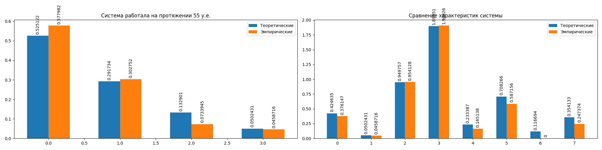

Черкас Ангелина 853502

Имеется одноканальная СМО с очередью, ограниченной числом мест R = 2. На вход СМО
поступает простейший по ток заявок с интенсивностью X. Время обслуживания
распределено по обобщенному закону Эрланга с параметрами k, X2. Найти вероятности
состояний СМО и характеристики эффективности СМО.

Вероятность образования очереди    
теор  - 0.42464 - 0.32692 - эмпир, разница - 0.09771  
Вероятность отказа  
теор  - 0.05024 - 0.01923 - эмпир, разница - 0.03101  
Относитальная пропускная способность  
теор  - 0.94976 - 0.98077 - эмпир, разница - 0.03101  
Абсолютная пропускная способность  
теор  - 1.89951 - 1.96154 - эмпир, разница - 0.06202  
Среднее число элементов в очереди  
теор  - 0.23339 - 0.11429 - эмпир, разница - 0.1191  
Среднее число элементов в СМО  
теор  - 0.70827 - 0.45714 - эмпир, разница - 0.25112  
Среднее время пребывания элемента в очереди  
теор  - 0.11669 - 0.0 - эмпир, разница - 0.11669  
Среднее время пребывания элемента в СМО  
теор  - 0.35413 - 0.22342 - эмпир, разница - 0.13072  

